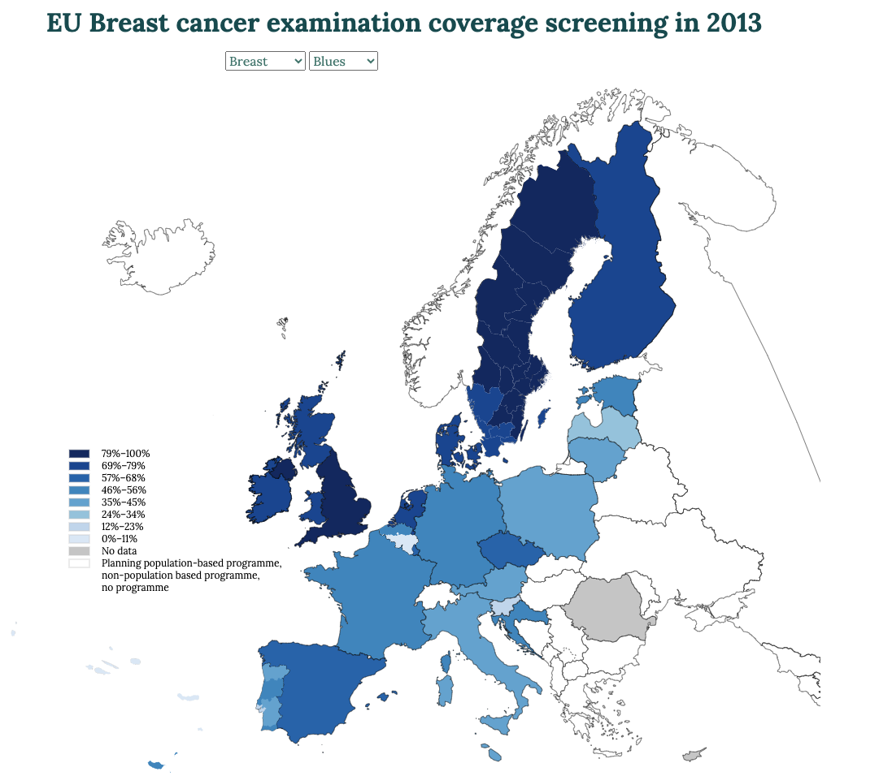

# EU Breast Cancer Screening map

EU Breast cancer examination coverage screening in 2013. Simple map asked by EPR. 



There are many ways to run the project, as soon as index.html file is opened into a browser. 

## Run the project with Python

See official documentation into Python website: https://docs.python.org/3/library/http.server.html.

```
python -m SimpleHTTPServer 8099  // (Python 2.7.10)
```
or

```
python3 -m http.server 8099
python3 -m http.server 8099 --bind 10.50.1.111
```
